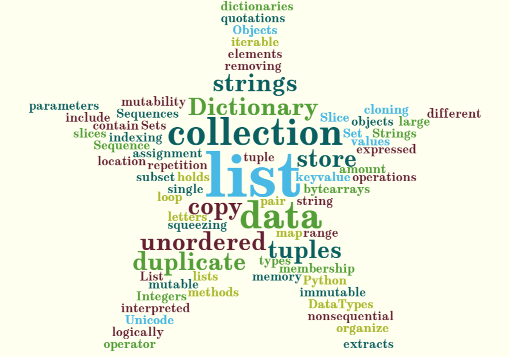

# **UNIT IV LISTS, TUPLES, DICTIONARIES** 


Lists: list operations, list slices, list methods, list loop, mutability, aliasing, cloning lists, list parameters; Tuples: tuple assignment, tuple as return value; Dictionaries: operations and methods; advanced list processing - list comprehension; Illustrative programs: selection sort, insertion sort, mergesort, histogram.

# **Table of Contents**

  [4.1 Key Terminologies](#key-terminologies)
  [4.2 Built-in Types in Python – Quick Reference](#built-in-types-in-python---quick-reference)
  [4.3 Lists](#lists) 
    [4.3.1 List Introduction](#list-introduction)
    [4.3.2 Operations in List](#operations-in-list)
    [4.3.3 List slice property](#list-slice-property)
    [4.3.4 Methods involved in List](#methods-involved-in-list)
    [4.3.5 Looping in List](#looping-in-list)
    [4.3.6 List mutability](#list-mutability)
    [4.3.7 Aliasing the List](#alisasing-the-list)
    [4.3.8 Cloning the List](#cloning-the-list)
    [4.3.9 List as Parameters](#list-as-parameters)
  [4.4 Tuple](#tuple)
    [4.4.1 Tuple Introduction](#tuple-introduction)
    [4.4.2 Assigning Values to Tuples](#assigning-values-to-tuples)
    [4.4.3 Tuple used as return value](#tuple-used-as-return-value)
  [4.5 Dictionary](#dictionary)
    [4.5.1 Dictionary Introduction](#dictionary-introduction)
    [4.5.2 Operations performed in dictionary](#operations-performed-in-dictionary)
    [4.5.3 Methods in dictionary](#methods-in-dictionary) 
  [4.6 List, Tuple and Dictionary differences](#list-,-tuple-and-dictionary-differences)
  [4.7 Advanced List Processing](#advanced-list-processing)
    [4.7.1 List Comprehension](#list-comprehension)
    [4.7.2 Nested List](#nested-list)

# **OTHER REFERENCES**

- Understanding the built-in data types – [list](https://www.geeksforgeeks.org/python-list/)
- Different methods of – [tuples](https://www.geeksforgeeks.org/tuples-in-python/), [methods of tuples](https://www.tutorialspoint.com/python/python_tuples.htm)
- Various ways of accessing [dictionary](https://www.geeksforgeeks.org/python-dictionary/)

# **KEY TERMINOLOGIES**

- Mutable – the value of the variable can be changed 
- Immutable – the value of the variable cannot be changed
- Slice – to print a part of a variable it is especially used in the list. It uses slice operator [:]
- Aliasing – duplicating a list which points to a same memory. If any changes made in original list it will be reflected in the duplicated list. It is different from copying a list.
- Cloning – creating a copy of a list with different memory location. It is also called as copying a list.
- Indexing – accessing the items of a list or tuple through its position.
- Key-Value pair – In dictionary, the data is held key:value manner in which, Values in a dictionary can be of any data type and can be duplicated, whereas keys can’t be repeated and must be immutable. Values in a dictionary can be of any data type and can be duplicated, whereas keys can’t be repeated and must be immutable. Dictionary keys are case sensitive, the same name but different cases of Key will be treated distinctly. 


# BUILT-IN TYPES IN PYTHON - QUICK REFERENCE

Sequences allow you to logically organize and store a large amount of data. **Sequence types** include strings, Unicode strings, lists, tuples, bytearrays, and range objects. Sets and dictionaries are used to hold non-sequential data. 

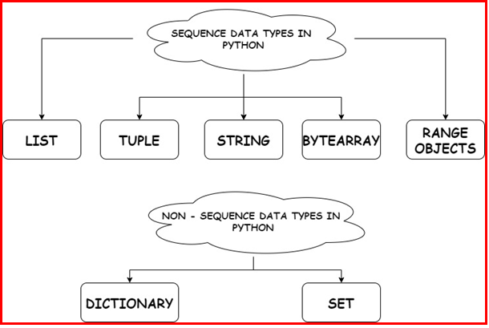

**String:**

The collection of letters expressed in quotations can be interpreted as the **string**. To construct a string in Python, we can use solitary, double, or triple quotations.

Strings are unchangeable Unicode code point combinations.
```python
str="HELLO"

print(str)
```
Sample Output:

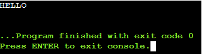


**Accessing Elements of a string:**
```python
str=“WELCOME”
print(str[0],“is first character of the given string”)
print(str[-1],“is last character of the given string”)
```
**Sample Output:**

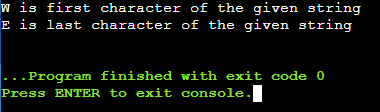


**List:**

Lists are just like dynamic sized arrays, declared in other languages. Lists need not be homogeneous always which makes it a most powerful tool in Python. A single list may contain DataTypes like Integers, Strings, as well as Objects. Lists are mutable, and hence, they can be altered even after their creation.

Lists in Python can be created by just placing the sequence inside the square brackets [].
```python
# Creating a List
List = []
print("Blank List: ")
print(List)
```
**Sample Output:**

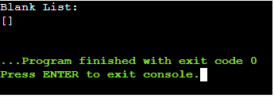


```python
# Creating a List of various values
List = [10, “Hello”, 14.25]
print("List of numbers: ")
print(List)
```
**Sample Output:**


**Tuples:**

Just like list, tuple is also an ordered collection of Python objects. The only difference between tuple and list is that tuples are immutable i.e. tuples cannot be modified after it is created. It is represented by tuple class.

In Python, tuples are created by placing a sequence of values separated by ‘comma’ with the use of parentheses for grouping of the data sequence. Tuples can contain any number of elements and of any datatype (like strings, integers, list, etc.).
```python
# Creating a Tuple of various values
Tuple1 = (10.89, "Hello", 36,'123')
print("Tuple of various values: ")
print(Tuple1)
```
**Sample Output:**

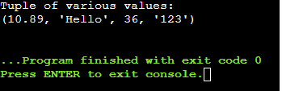


**Set**

In Python, Set is an unordered collection of data type that is iterable, mutable and has no duplicate elements. The order of elements in a set is undefined though it may consist of various elements. Sets can be created by using the built-in set() function with an iterable object or a sequence by placing the sequence inside curly braces, separated by ‘comma’. Type of elements in a set need not be the same, various mixed-up data type values can also be passed to the set.


```python
# Creating a Set with a mixed type of values  (Having numbers and strings)
set1 = set([1, 2, 'Welcome', 4, 'to', 6, 'Python']) 
print("\nSet with the use of Mixed Values") 
print(set1) 
```
**Sample Output:**

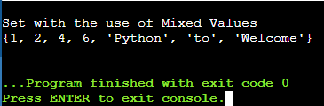


**Dictionary**

Dictionary in Python is an unordered collection of data values, used to store data values like a map, which unlike other Data Types that hold only single value as an element, Dictionary holds key:value pair. Key-value is provided in the dictionary to make it more optimized. Each key-value pair in a Dictionary is separated by a colon :, whereas each key is separated by a ‘comma’. 

In Python, a Dictionary can be created by placing a sequence of elements within curly {} braces, separated by ‘comma’. Values in a dictionary can be of any datatype and can be duplicated, whereas keys can’t be repeated and must be immutable. Dictionary can also be created by the built-in function dict(). An empty dictionary can be created by just placing it to curly braces{}.
```python
# Creating a Dictionary with Integer Keys
Dict = {1: 'Welcome', 2: 'to', 3: 'Python'} 
print("\nDictionary with the use of Integer Keys: ") 
print(Dict) 
```
**Sample Output:**

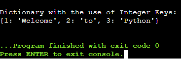


# **LISTS**

# List Introduction

- A list is a collection of information in a specific order. The list's entries usually referred to as elements or items.
- Within square brackets, it could be represented as a list of comma-separated elements (scores) [].
- List need not be homogeneous in nature. It can hold different values.

# Operations on list:
- **Creating a List**
```python
>>>L1=[1,"APPLE",9.5,"123"]
>>>print(L1)
```

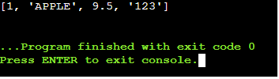


- **Indexing**
```python
>>>L1=[1,"APPLE",9.5,"123"]
>>>print(L1[2])
>>>print(L1[-1])
```

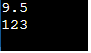

- **Slicing**
```python
>>> L1=[1,"APPLE",9.5,"123"]
>>>print(L1[2:])
```

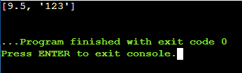


- **Concatenation**
```python
>>> L1=[1,"APPLE",9.5,"123"]
>>>L2=[2.86,” MANGO”,”BELL”]
>>>print(L1+L2)
```
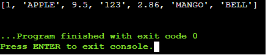

- **Repetitions**
```python
>>>x=[1,2,’a’]
>>>print(x\*4) **#print(4\*x) also correct**
```

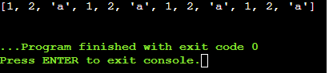

- **Updating**
```python
>>> L1=[1,"APPLE",9.5,"123"]
>>>print(L1)
>>>L1[3]=463
>>>print(L1)
```

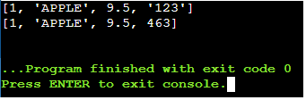


- **Membership**
```python
>>> L1=[1,"APPLE",9.5,"123"]
>>>print(123 in L1)
>>>false
>>>print(”123” in L1)
>>>true
```
# List Slice Property:

List slicing is an operation that extracts a subset of elements from a list and packages them as another list.

**Syntax:**

**Listname[start:stop]** 

**Listname[start:stop:steps]**

- default start value is 0
- default stop value is n-1
- [:] this will print the entire list

**Examples:**
```python
>>>a=[2,3,8.9,4,7,15,3.5]
>>>print(a[0:3])
>>>print(a[:5])
>>>print(a[2:])
>>>print(a[:])
>>>print(a[4:4])
>>>print(a[0:7:2])
>>>print(a[::-1])
>>>print(a[-4:-1])
```

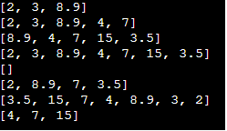

# Methods involved in List:

- Methods used in lists are used to manipulate the data quickly.
- These methods work only on lists.
- They do not work on the other sequence types that are not mutable, that is, the values they contain cannot be changed, added, or deleted.

**syntax:**

**list name.method name( element/index/list)**

- 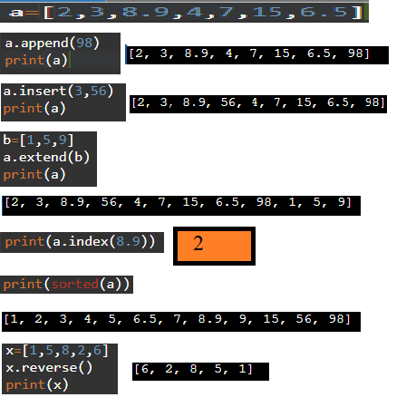

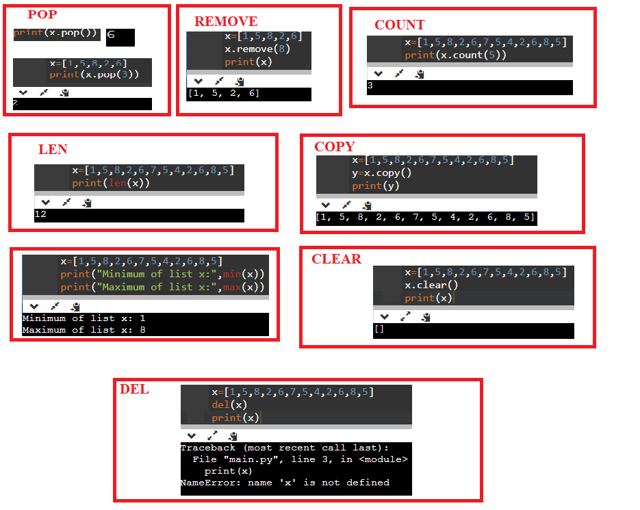

# Looping in List

**List using For Loop**

- The for loop in Python is used to iterate over a sequence (list, tuple, string) or other iterable objects.
- Iterating on a series is called traversal.
- Loop persists until it arrives at the final element in the series.
- The body of for loop is divided from the rest of the code using indentation.

**EXAMPLES**

**Accessing element in list using For Loop**

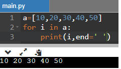

**Accessing index of list using For Loop** 

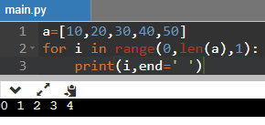

**Accessing elements of list using range in For Loop**

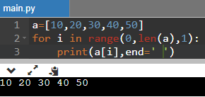


**List using While loop**
- The while loop in Python is used to iterate over a chunk of code as long as the test expression (condition) is true.
- When the condition is tested and the end result is false, the loop body will be passed over and the first statement after the while loop will be carried out.

**Sum of Elements using While Loop**

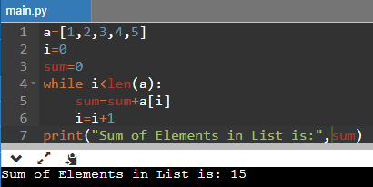


**Infinite Loop:**
If the supplied criterion never becomes wrong, the loop remains indefinite. It continues to run. The term "infinite loop" refers to such loops.

# List Mutability

- Lists are mutable data types in Python because the list's items can indeed be updated, individual items can be changed, and the sequence of the items can be altered after the list has been constructed.
- Lists are mutable. (can be changed)
- Mutability is the ability for certain types of data to be changed without entirely recreating it.
- An item can be changed in a list by accessing it directly as part of the assignment statement.
- Using the indexing operator (square brackets []) on the left side of an assignment, one of the list items can be updated.


**Changing a single element in a List:**

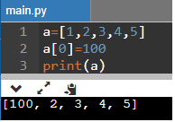


**Changing multiple elements in a List:**

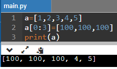


**Removing Elements from list:** 

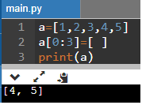


**Squeezing list to insert values:**

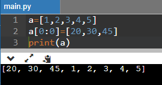


# Aliasing the List

- Creating a copy of a list is called aliasing. When you create a copy both list will be having same memory location. Changes in one list will affect another list.
- Aliasing refers to having different names for same list values.

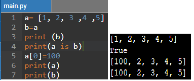

- The subscript operator is used to construct and modify a particular list item..
- When the first member of the list labeled "a" is changed, it also replaces the first item in the list labeled "b."
- A side effect is a term used to describe this process of reform. This occurs since the identifiers a and b relate to a certain list item after the allocation b=a.
- They are aliases for the same object. This phenomenon is known as aliasing.
- To prevent aliasing an object can be created and the contents of the original can be copied which is called cloning.

# Clonning the List

- To avoid the disadvantages of copying we are using cloning. Creating a copy of a same list of elements with two different memory locations is called cloning.
- Changes in one list will not affect locations of another list.
- Cloning is a process of making a copy of the list without modifying the original list.
- Methods of clonning:
  - Slicing
  - list() method
  - copy() method


**Cloning using Slicing:**			

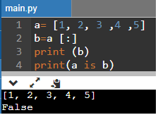

**Cloning using List() Method**

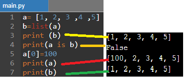


**Cloning using copy() method**

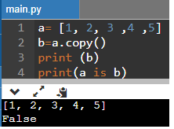


# List as Parameters:

- In python, arguments are passed by reference.
- If any changes are done in the parameter which refers within the function, then the changes also reflect back in the calling function.
- When a list to a function is passed, the function gets a reference to the list.
- Passing a list as an argument actually passes a reference to the list, not a copy of the list.

**EXAMPLES**

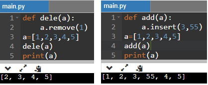


# **TUPLES**

# Tuple Introduction

- Since lists are mutable, changes made to the elements referenced by the parameter change the same list that the argument is referencing.
- A tuple is same as list, except that the set of elements is enclosed in parentheses instead of square brackets.
- A tuple is an immutable list. i.e., once a tuple has been created, you can't add elements to a tuple or remove elements from the tuple.
- But tuple can be converted into list and list can be converted in to tuple.
**Benefit of Tuple:**
- Tuples are faster than lists.
- If the user wants to protect the data from accidental changes, tuple can be used.
- Tuples can be used as keys in dictionaries, while lists can't.

**Operations on Tuples:**
- Indexing
- Slicing
- Concatenation
- Repetitions
- Membership
- Comparison

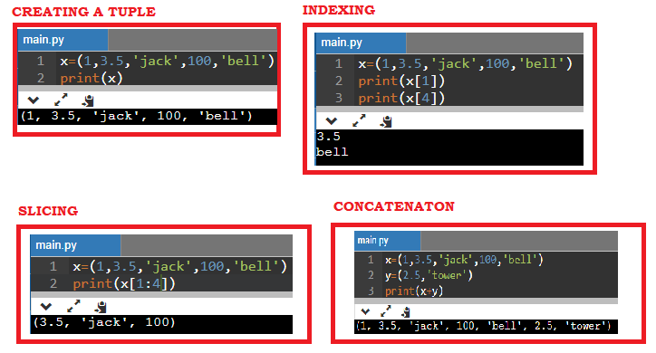

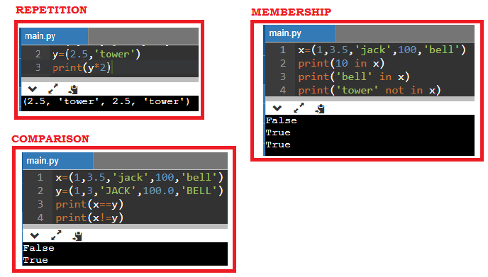

**Tuple Methods**

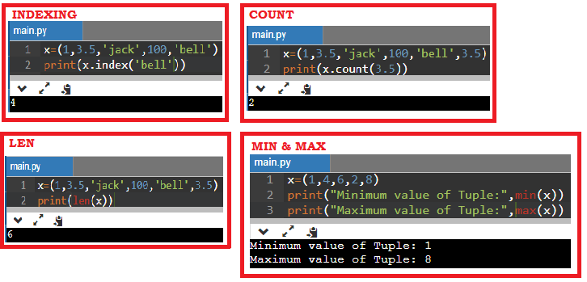

Tuple is immutable so changes cannot be done on the elements of a tuple once it is assigned.

# Assigning Value to Tuples:

- Tuple assignment allows variables on the left of an assignment operator and values of tuple on the right of the assignment operator.
- Multiple assignment works by creating a tuple of expressions from the right-hand side, and a tuple of targets from the left, and then matching each expression to a target.
- Because multiple assignments use tuples to work, it is often termed tuple assignment.
**Uses of Tuple assignment:**
It is often useful to swap the values of two variables.
**Example:**

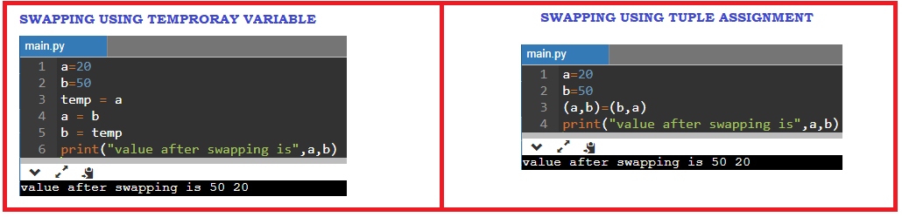

**Multiple assignments:**

Multiple values can be assigned to multiple variables using tuple assignment.

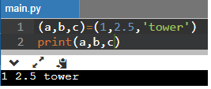


# Tuple as return value

- A Tuple is a comma separated sequence of items.
- It is created with or without ().
- A function can return one value. If you want to return more than one value from a function. we can use tuple as return value

**EXAMPLE**

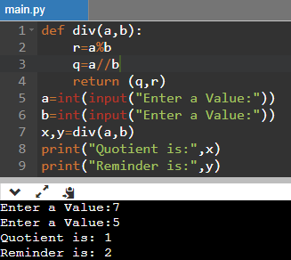

**Tuple as Argument**

The parameter name that begins with \* gathers argument into a tuple.

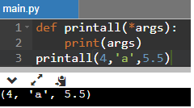

# **Dictionaries**

# Dictionary Introduction

- Dictionary is an unordered collection of elements. An element in dictionary has a key: valuepair.
- All elements in dictionary are placed inside the curly braces i.e. {}
- Elements in Dictionaries are accessed via keys and not by their position.
- The values of a dictionary can be any data type.
- Keys must be immutable data type (numbers, strings, tuple)

# Operations on dictionary:
- Accessing an element
- Update
- Add element
- Membership

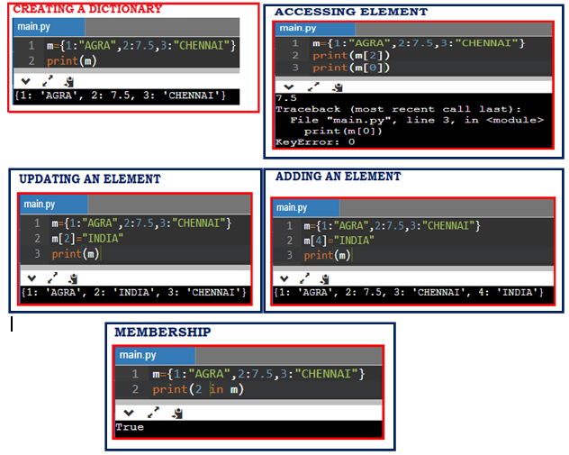

# Methods in Dictionary

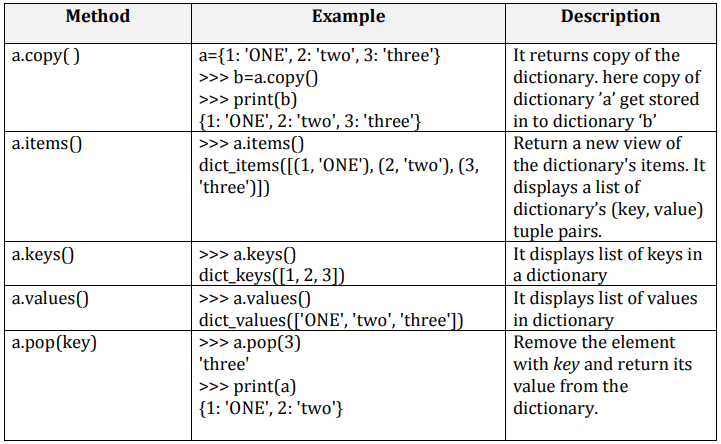

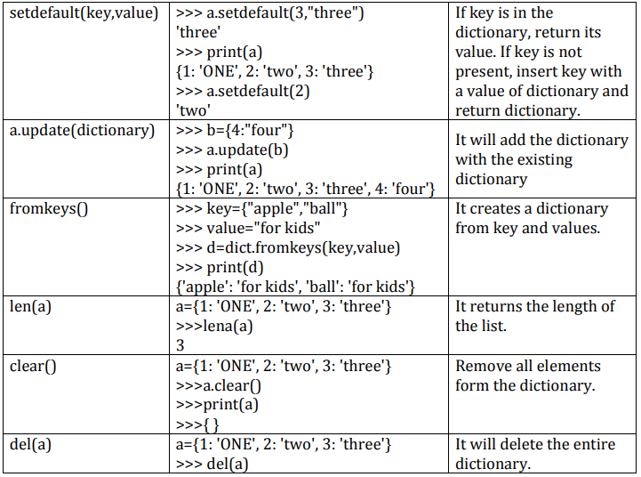

# List, Tuple and Dictionary differences

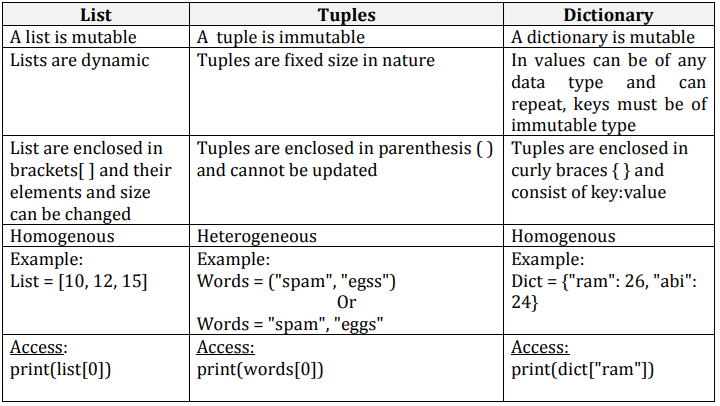

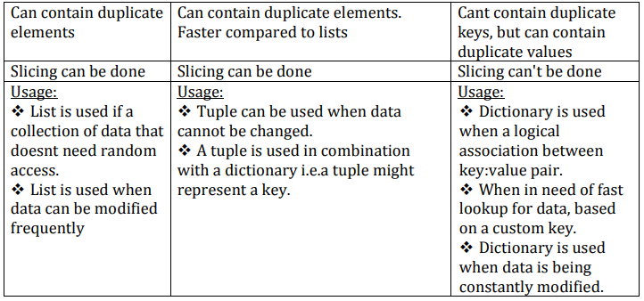

# Advanced List Processing

# List Comprehension:

- List comprehensions provide a concise way to apply operations on alist.
- It creates a new list in which each element is the result of applying a given operation in a list.
- It consists of brackets containing an expression followed by a “for” clause, then a list.
- The list comprehension always returns a result list.
**Syntax**
**list=[ expression for item in list if conditional ]**

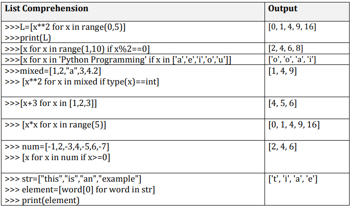

# Nested List

List inside another list is called nested list.

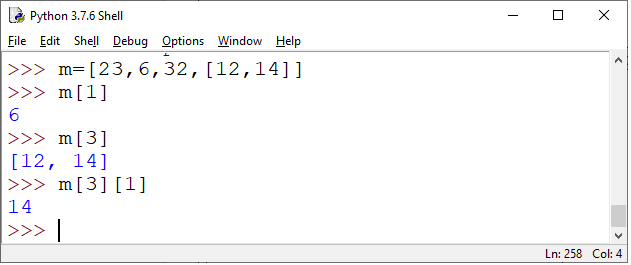

**Matrix Addition Program**

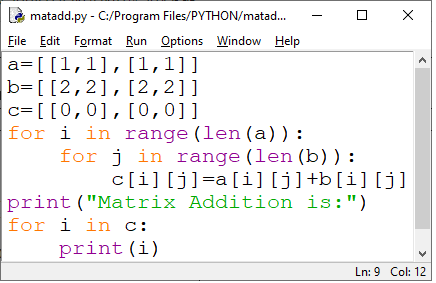


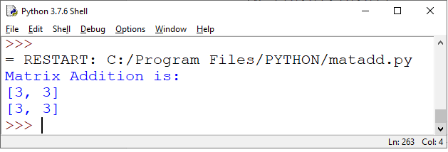
